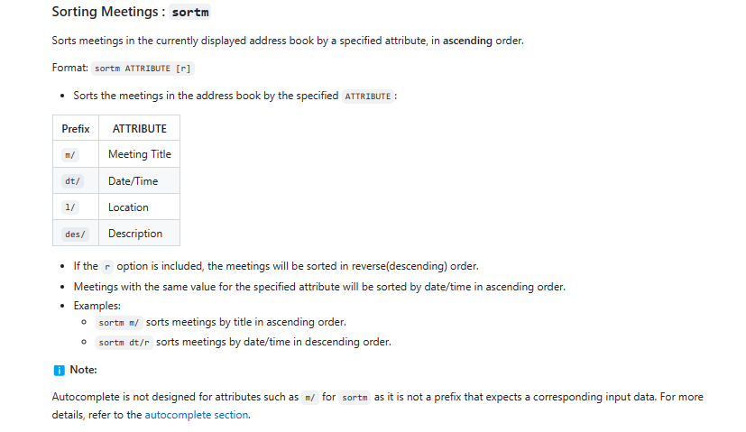

### Project: QuickContacts
QuickContacts is a contacts and schedule management system that enables you to track your contacts and manage your schedule with ease! QuickContacts is CLI-focused and designed for efficiency. It is written in Java, and has about 10 kLoC.

Given below are my contributions to the project.

* **Code contributed**: [RepoSense link](https://nus-cs2103-ay2223s2.github.io/tp-dashboard/?search=jeremykhoo&sort=groupTitle&sortWithin=title&since=2023-02-17&timeframe=commit&mergegroup=&groupSelect=groupByRepos&breakdown=false)
### Commands: Editm
* Allows editing of meeting details
#### Reflection:
Easy to implement. Similar to AB3 edit command for a person. Was a good 1st feature to implement to get use to the code base

### Commands: Sortm
* Allows sorting of meeting by their attributes
#### Reflection:
Medium difficulty to implement. The difficulty was that all the command presented `FilteredList` to be displayed in the UI
in the JavaFX 11, sort was not yet implemented for `FilteredList`
The work round was to pass comparators down to the `ObservableList` that `FilteredList` inherits and sort the underlying list instead
Another difficulty was, trying to sort with our custom DateTime object.
This required me to work close with the teammate that implemented the DateTime object.

### Bug fix: Editing name of person updates the corresponding name in the meeting panel
* Before: The meeting Panel would have the old name, even though the person's name was updated
* Currently: The meeting Panel update the person's name, when person updates his name
#### Reflection:
Hardest to implement. `Person` and `Meetings` are immutable. To have `Meeting` object update the name of person in the meeting when there is a change in person's name. `Person` has to call all meetings it is part of to inform it of its name change. When this happens `Meeting` has to update the `model` to change its list because it cannot do it itself (it is immutable).

Additionally, `Person` has to hold a list of meeting it is attending, which it previously did not have. Like Meetings, it has to call `model` to update the list for itself. It needs this list to know which `Meeting` to inform when it changes name.

The difficulty was, implementing new attributes for Person and dealing with immutable objects, and enabling communication between two objects that should not depend on one another

* Help menu:
    * Preliminary help menu improvement

* **Project management**:
    * Overviewed the development of the Guides
    * Reviewed Code for all Command related features

* **Documentation**:
  ## User Guide:
* Add preliminary information to User guide
* Described Sortm
* Described Editm

Below is the description for sortm

## Developer Guide:
* Wrote all the MSS
* Wrote all the User Stories
* Add preliminary information to Developer guide
* Wrote Implementation for CRUD operations, sort and find operation
* Drew all the sequence diagram for each CRUD, sort and find operation

Below is example of one of such page

* **Community**:
  PR reviewed:
  [#178](https://github.com/AY2223S2-CS2103T-T11-2/tp/pull/178)
  [#47](https://github.com/AY2223S2-CS2103T-T11-2/tp/pull/47)
  [#67](https://github.com/AY2223S2-CS2103T-T11-2/tp/pull/67)
  [#64](https://github.com/AY2223S2-CS2103T-T11-2/tp/pull/64)
  [#48](https://github.com/AY2223S2-CS2103T-T11-2/tp/pull/48)
  [#114](https://github.com/AY2223S2-CS2103T-T11-2/tp/pull/114)
  [#115](https://github.com/AY2223S2-CS2103T-T11-2/tp/pull/115)

* **Tools**:
  The following are the tools I used to contribute to the project in order of frequency of use
    * Vim
        * Was used as main IDE
    * Git
        * Used as version control
    * JDB
        * Used as debugging tool, in terminal environment
    * Gradle
        * Used as package builder
    * IntelliJ
        * Used to edit markdown and PLANTUML extension
